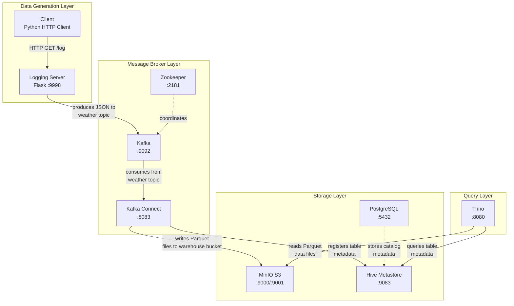
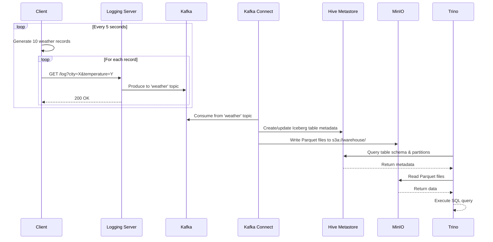

# Data Pipeline Project Plan

A Docker Compose-based data pipeline that generates fake weather data, sends it through a logging server to Kafka, writes to Iceberg tables on MinIO via Kafka Connect, and enables querying via Trino.

## Architecture Diagram



## Data Flow



## Container Details

| Container | Image | Port | Purpose |
|-----------|-------|------|---------|
| minio | minio/minio | 9000, 9001 | S3-compatible object storage for Iceberg data files |
| minio-init | minio/mc | - | Initializes the 'warehouse' bucket |
| postgres | postgres:15 | 5432 | Backend database for Hive Metastore |
| hive-metastore | Custom | 9083 | Iceberg table catalog (Thrift service) |
| zookeeper | confluentinc/cp-zookeeper:7.5.0 | 2181 | Kafka cluster coordination |
| kafka | confluentinc/cp-kafka:7.5.0 | 9092 | Message broker |
| kafka-connect | Custom | 8083 | Runs Iceberg sink connector |
| logging-server | Custom | 9998 | Flask web server that receives weather data and sends to Kafka |
| client | Custom | - | Python HTTP client generating weather data |
| trino | trinodb/trino | 8080 | SQL query engine for Iceberg tables |

## Directory Structure

```
├── compose.yaml                 # Docker Compose configuration
├── run.sh                       # Build and startup script
├── PLAN.md                      # This file
├── client/
│   ├── Dockerfile               # Python 3.11 slim image
│   ├── producer.py              # HTTP client sending to logging server
│   └── requirements.txt         # requests, faker
├── logging-server/
│   ├── Dockerfile               # Python 3.11 slim + Flask
│   ├── server.py                # Flask server with /log endpoint
│   └── requirements.txt         # flask, confluent-kafka
├── hive-metastore/
│   ├── Dockerfile               # Eclipse Temurin JRE 11 + Hive 3.1.3
│   └── metastore-site.xml       # Metastore configuration
├── kafka-connect/
│   ├── Dockerfile               # Confluent Kafka Connect + Iceberg connector
│   └── register-connector.sh    # Connector registration script
└── trino/
    └── etc/
        ├── config.properties    # Trino server config
        ├── node.properties      # Trino node config
        ├── jvm.config           # JVM settings
        └── catalog/
            └── iceberg.properties  # Iceberg catalog config
```

## Logging Server API

### GET /log

Accepts weather data and sends it to Kafka.

**Query Parameters:**
| Parameter | Type | Required | Description |
|-----------|------|----------|-------------|
| city | string | Yes | City name |
| temperature | string | Yes | Temperature value |

**Response:**
```json
{
  "status": "success",
  "message": "Weather data logged",
  "data": {
    "city": "New York",
    "temperature": "72.5",
    "ts": "14"
  }
}
```

### GET /health

Health check endpoint.

**Response:**
```json
{
  "status": "healthy"
}
```

## Data Schema

The weather data has the following JSON structure:

```json
{
  "city": "North Sharonstad",
  "temperature": "80.59",
  "ts": "2026-01-08-14"
}
```

| Field | Type | Description |
|-------|------|-------------|
| city | string | Randomly generated fake city name |
| temperature | string | Random temperature (0-120°F) |
| ts | string | Timestamp in YYYY-MM-DD-HH format, used for partitioning |

## Iceberg Table

- **Database**: default
- **Table**: weather
- **Partition**: ts (hour of day)
- **Location**: s3a://warehouse/default/weather
- **File Format**: Parquet

## Configuration

### Credentials

| Service | Username | Password |
|---------|----------|----------|
| MinIO | admin | password |
| PostgreSQL | hive | hive |

### Network

All containers are connected via the `datapipeline` bridge network.

## Usage

### Start the Pipeline

```bash
./run.sh
```

This will:
1. Build custom Docker images
2. Start all services
3. Wait for Kafka Connect to be ready
4. Register the Iceberg sink connector

### Test the Logging Server

```bash
# Send a test weather record
curl "http://localhost:9998/log?city=TestCity&temperature=75.5"

# Check health
curl http://localhost:9998/health
```

### Query Data with Trino

```bash
docker exec -it trino trino
```

```sql
-- Show catalogs
SHOW CATALOGS;

-- Show tables
SHOW TABLES FROM iceberg.default;

-- Query weather data
SELECT * FROM iceberg.default.weather;

-- Query by partition
SELECT * FROM iceberg.default.weather WHERE ts = '14';

-- Aggregate queries
SELECT city, AVG(CAST(temperature AS DOUBLE)) as avg_temp 
FROM iceberg.default.weather 
GROUP BY city;
```

### View Logs

```bash
# Client logs
docker compose logs -f client

# Logging server logs
docker compose logs -f logging-server

# Kafka Connect logs
docker compose logs -f kafka-connect

# All logs
docker compose logs -f
```

### Access Services

- **Logging Server**: http://localhost:9998
- **MinIO Console**: http://localhost:9001 (admin/password)
- **Kafka Connect REST API**: http://localhost:8083
- **Trino Web UI**: http://localhost:8080

### Stop the Pipeline

```bash
docker compose down
```

### Clean Up Everything

```bash
docker compose down -v  # Removes volumes too
```

## Troubleshooting

### Check Connector Status

```bash
curl http://localhost:8083/connectors/iceberg-sink/status | jq
```

### Restart a Failed Connector Task

```bash
curl -X POST http://localhost:8083/connectors/iceberg-sink/tasks/0/restart
```

### Check Kafka Topics

```bash
docker exec -it kafka kafka-topics --bootstrap-server localhost:9092 --list
```

### Check MinIO Bucket Contents

```bash
docker exec -it minio mc ls myminio/warehouse --recursive
```
